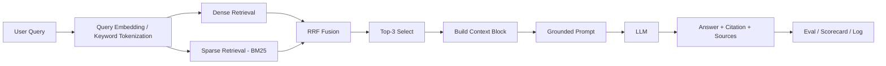

# Architecture — RAG Pipeline (Day 08 Lab)

Tài liệu này mô tả kiến trúc cuối cùng của nhóm sau khi hoàn tất Sprint 1-4. Hệ thống phục vụ câu hỏi nội bộ cho CS + IT Helpdesk, ưu tiên trả lời có dẫn chứng, hạn chế hallucination, và có cơ chế abstain khi tài liệu không đủ dữ liệu.

---

## 1. Tổng quan kiến trúc

```text
[Raw Docs in data/docs]
    ↓
[index.py: preprocess_document -> chunk_document -> get_embedding -> build_index]
    ↓
[ChromaDB Persistent Vector Store]
    ↓
[rag_answer.py: retrieve_dense / retrieve_sparse / retrieve_hybrid -> rerank optional -> build_context_block -> build_grounded_prompt -> call_llm]
    ↓
[Answer + Sources + Chunks Used + Config]
    ↓
[eval.py: scorecard + A/B comparison + grading_run.json]
```

Hệ thống được thiết kế để trả lời các câu như SLA ticket P1, hoàn tiền, và cấp quyền truy cập nội bộ. Điểm quan trọng nhất là mỗi câu trả lời phải bám vào chunk đã retrieve và có citation rõ ràng, thay vì dựa trên kiến thức chung của model.

---

## 2. Indexing Pipeline (Sprint 1)

### Tài liệu được index

| File | Nguồn | Department | Số chunk |
|------|-------|-----------|---------|
| `policy_refund_v4.txt` | `policy/refund-v4.pdf` | CS | 6 |
| `sla_p1_2026.txt` | `support/sla-p1-2026.pdf` | IT | 5 |
| `access_control_sop.txt` | `it/access-control-sop.md` | IT Security | 7 |
| `it_helpdesk_faq.txt` | `support/helpdesk-faq.md` | IT | 6 |
| `hr_leave_policy.txt` | `hr/leave-policy-2026.pdf` | HR | 5 |

Tổng số chunks sau indexing là **29**.

### Quyết định chunking

| Tham số | Giá trị | Lý do |
|---------|---------|-------|
| Chunk size | 400 tokens ước lượng | Đủ giữ ngữ cảnh điều khoản nhưng không quá dài để làm loãng retrieval |
| Overlap | 80 tokens ước lượng | Giảm nguy cơ cắt giữa câu và giữ continuity giữa các đoạn liền kề |
| Chunking strategy | Section-based + paragraph-aware | Bám theo heading tự nhiên của tài liệu và tránh tách rời điều khoản |
| Metadata fields | source, section, effective_date, department, access | Phục vụ truy vết, freshness, lọc theo phòng ban và citation |

### Kết quả kiểm tra Sprint 1

- `python index.py` chạy thành công và tạo index ChromaDB.
- `list_chunks()` hiển thị chunk hợp lý, không cắt giữa điều khoản lớn.
- `inspect_metadata_coverage()` cho thấy **0 chunks thiếu `effective_date`**.
- Phân bố metadata sau indexing: CS 6 chunks, HR 5 chunks, IT 11 chunks, IT Security 7 chunks.

### Embedding model

- **Model**: OpenAI `text-embedding-3-small`
- **Vector store**: ChromaDB (`PersistentClient`)
- **Similarity metric**: cosine

---

## 3. Retrieval Pipeline (Sprint 2 + 3)

### Baseline (Sprint 2)

| Tham số | Giá trị |
|---------|---------|
| Strategy | Dense retrieval bằng embedding similarity |
| Top-k search | 10 |
| Top-k select | 3 |
| Rerank | Không |

### Variant cuối cùng (Sprint 3)

| Tham số | Giá trị | Thay đổi so với baseline |
|---------|---------|------------------------|
| Strategy | Hybrid retrieval + rerank | Kết hợp dense + sparse để tăng recall cho cả câu tự nhiên lẫn keyword, sau đó lọc nhiễu bằng reranker |
| Top-k search | 10 | Giữ nguyên để A/B công bằng |
| Top-k select | 3 | Giữ nguyên để context vào LLM không đổi |
| Rerank | Có | Dùng Cross-Encoder để loại chunk rác |
| Query transform | Không áp dụng | Không đổi |

### Lý do chọn variant này

Nhóm chọn **hybrid retrieval** vì corpus có hai kiểu truy vấn khác nhau:
- câu tự nhiên như “Khách hàng có thể yêu cầu hoàn tiền trong bao nhiêu ngày?”
- câu có keyword/mã đặc thù như “SLA ticket P1”, “Level 3”, “ERR-403”

Dense retrieval tốt với ngữ nghĩa, nhưng dễ bỏ lỡ keyword chính xác. Hybrid giúp bổ sung sparse/BM25 để tăng khả năng kéo đúng chunk khi truy vấn chứa từ khóa đặc thù hoặc tên mục điều khoản.

### Quan sát từ Sprint 3 và Sprint 4

Sprint 3 cho thấy hybrid bản đầu còn nhiễu, đặc biệt với câu OOD như `ERR-403`. Dense + sparse giúp tăng recall nhưng BM25 kéo nhiều chunk rác.

Sprint 4 thêm stopword filtering, rerank, và sửa evaluation context để kết quả ổn định hơn. Đây là lúc variant chuyển từ “đúng hướng nhưng còn nhiễu” sang “đủ sạch để nộp”.

Các test so sánh cho thấy hybrid cải thiện khả năng kéo đúng source trong các query có keyword rõ, ví dụ:
- `SLA P1 xử lý bao lâu?` -> hybrid giữ đúng `support/sla-p1-2026.pdf`
- `ERR-403` -> rerank giúp loại chunk nhiễu và an toàn hơn khi abstain

### Diễn tiến tối ưu hóa

1. Sprint 2 baseline: dense retrieval ổn định nhưng bỏ lỡ keyword/alias ở vài câu.
2. Sprint 3 hybrid lần 1: recall tăng nhưng nhiễu tăng, nhất là với OOD/keyword mơ hồ.
3. Sprint 4 final: thêm stopword filtering và Cross-Encoder rerank để loại chunk rác; đồng thời sửa eval context để đánh giá phản ánh đúng chất lượng.

> Ghi chú: compare chính thức trong báo cáo dùng variant đã ổn định ở Sprint 4. Biến chính được ghi nhận là retrieval mode; stopword/rerank là phần tối ưu trong cùng nhánh variant.

---

## 4. Generation (Sprint 2)

### Grounded Prompt Template

```text
Answer only from the retrieved context below.
If the context is insufficient to answer the question, say you do not know and do not make up information.
Cite the source field (in brackets like [1]) when possible.
Keep your answer short, clear, and factual.
Respond in the same language as the question.

Question: {query}

Context:
[1] {source} | {section} | score={score}
{chunk_text}

Answer:
```

### LLM Configuration

| Tham số | Giá trị |
|---------|---------|
| Model | `gpt-4o-mini` |
| Temperature | 0 |
| Max tokens | 512 |

### Hành vi mong đợi

- Trả lời ngắn, có citation `[1]` nếu có đủ context.
- Nếu không đủ bằng chứng, abstain rõ ràng thay vì bịa.
- Giữ ngôn ngữ theo ngôn ngữ của câu hỏi.

---

## 5. Evaluation Path (Sprint 4)

### Chất lượng đo bằng gì

- Faithfulness: câu trả lời có bám vào context không.
- Answer Relevance: trả lời đúng trọng tâm câu hỏi không.
- Context Recall: source đúng có được retrieve không.
- Completeness: câu trả lời có đủ ý quan trọng không.

### File đầu ra của evaluation

- `results/scorecard_baseline.md`
- `results/scorecard_variant.md`
- `logs/grading_run.json`

---

## 6. Failure Mode Checklist

| Failure Mode | Triệu chứng | Cách kiểm tra |
|-------------|-------------|---------------|
| Index lỗi | Source sai version hoặc thiếu metadata | `inspect_metadata_coverage()` |
| Chunking tệ | Cắt giữa điều khoản hoặc thiếu ngữ cảnh | `list_chunks()` |
| Retrieval lỗi | Không kéo đúng expected source | `score_context_recall()` và so sánh top chunks |
| Generation lỗi | Câu trả lời không grounded / hallucination | Prompt + `score_faithfulness()` |
| Context overload | Context quá dài, answer loãng | Giữ `top_k_select = 3` |

---

## 7. Diagram



---

## 8. Kết luận thiết kế

Kiến trúc cuối cùng ưu tiên sự đơn giản và khả năng chứng minh bằng số liệu. Dense baseline làm nền, hybrid variant tăng khả năng bắt keyword và cải thiện Answer Relevance/Completeness trong compare thực nghiệm, trong khi vẫn giữ Context Recall ở mức tối đa.
