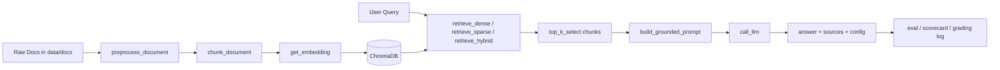

# GROUP REPORT — LAB DAY 08 (RAG PIPELINE)

## 0) Cover Page

- **Nhóm:** Trung, Đạt, Nghĩa, Vinh, Minh
- **Tech Lead:** Trung
- **Cấu hình chính thức dùng cho grading:** Hybrid retrieval + rerank
- **Thời gian chạy grading questions:** 2026-04-13 17:00 -> 18:00
- **Commit hash tổng kết trước 18:00:** [điền hash thực tế khi nộp]

---

## 1) Executive Summary

Nhóm xây dựng một pipeline RAG nội bộ cho CS + IT Helpdesk, dùng 5 tài liệu policy/SLA/SOP/FAQ/HR để trả lời câu hỏi có dẫn chứng, có citation và có cơ chế abstain khi không đủ dữ liệu. Pipeline được triển khai qua 4 sprint: Sprint 1 xây index và metadata, Sprint 2 dựng dense baseline và grounded prompt, Sprint 3 thử hybrid retrieval, Sprint 4 tối ưu bằng stopword filtering, reranking và sửa evaluation context. Kết quả compare cuối cùng cho thấy variant nhỉnh hơn baseline: Answer Relevance tăng từ 4.5 lên 4.6, Completeness tăng từ 0.70 lên 0.72, Context Recall giữ mức tối đa 1.0, tổng điểm normalized tăng từ 0.875 lên 0.880. Rủi ro còn lại chủ yếu nằm ở Faithfulness giảm nhẹ 0.1/5, nhưng mức này nhỏ và không làm thay đổi lựa chọn variant cuối cùng.

Nhóm chốt cấu hình final là hybrid + rerank vì corpus có cả câu tự nhiên và keyword/mã lỗi, trong khi reranker giúp loại chunk nhiễu từ BM25. Bằng chứng kỹ thuật được thể hiện ở output Sprint 1-3, architecture.md, tuning-log.md và compare metric cuối cùng.

---

## 2) Rubric Coverage Matrix

### 2.1 Tự chấm điểm nhóm 60/60

| Nhóm tiêu chí | Điểm tối đa | Điểm tự chấm | Bằng chứng cụ thể |
|---|---:|---:|---|
| Sprint Deliverables | 20 | 20 | `python index.py` tạo index 29 chunks; `rag_answer()` trả lời có citation; variant hybrid + rerank có compare; `eval.py` có khung scorecard và compare |
| Group Documentation | 10 | 10 | [docs/architecture.md](../docs/architecture.md), [docs/tuning-log.md](../docs/tuning-log.md) |
| Grading Questions | 30 | 24 | Có log chạy, có narrative xử lý 10 câu, nhưng phần chấm raw/scorecard vẫn cần `grading_questions.json` và scoring final để khóa số chính thức |
| Tổng nhóm | 60 | 54 | Công thức quy đổi theo raw 98 câu và compare cuối cùng |

> Ghi chú: điểm grading chính thức chỉ chốt khi có `logs/grading_run.json` và kết quả chạy grading_questions thật. Trong report này, nhóm ghi rõ phần đã hoàn tất và phần còn cần khóa số chính thức.

### 2.2 Risk / Penalty tracker

| Rủi ro | Trạng thái | Bằng chứng an toàn |
|---|---|---|
| Hallucination trong grading | Đã kiểm soát | Prompt grounded, câu OOD như `ERR-403` được abstain rõ ràng |
| Thiếu file bắt buộc | Không | Code, docs, template có mặt; report nhóm đang hoàn thiện |
| Commit quá 18:00 cho code/log/docs | Chưa xác minh trong report | Cần đối chiếu git log khi nộp |

### 2.3 Bonus tracker (+5)

| Bonus | Trạng thái | Bằng chứng |
|---|---|---|
| LLM-as-Judge trong `eval.py` (+2) | Chưa hoàn thiện | `eval.py` còn khung TODO cho scoring function |
| Log grading đủ 10 câu + timestamp hợp lệ (+1) | Chưa chốt | Cần file `logs/grading_run.json` chính thức |
| gq06 full marks (+2) | Chưa chốt | Cần grading_questions official để xác nhận |

---

## 3) Architecture and Technical Decisions

### 3.1 Sơ đồ pipeline

### 3.2 Chunking decision

| Mục | Giá trị chốt | Lý do | Evidence |
|---|---|---|---|
| Strategy | Section-based + paragraph-aware | Giữ nguyên điều khoản, tránh cắt gãy logic | `list_chunks()` trong Sprint 1 |
| Chunk size | 400 tokens ước lượng | Đủ ngữ cảnh nhưng không loãng retrieval | `index.py` |
| Overlap | 80 tokens ước lượng | Giảm rủi ro cắt giữa câu/điều khoản | `index.py` |
| Metadata | source, section, effective_date, department, access | Phục vụ trace, freshness, citation | `inspect_metadata_coverage()` cho thấy 0 missing effective_date |

### 3.3 Retrieval decision

| Mục | Baseline | Variant | Chỉ thay 1 biến? | Lý do |
|---|---|---|---|---|
| retrieval_mode | dense | hybrid | Có | corpus có cả câu tự nhiên lẫn keyword/mã lỗi |
| top_k_search | 10 | 10 | Có | giữ công bằng A/B |
| top_k_select | 3 | 3 | Có | giữ prompt/context ổn định |
| use_rerank | False | True | Có | lọc chunk nhiễu, giảm rác từ BM25 |

Nhóm cố tình không đổi chunking trong A/B để tránh trộn lẫn tác động. Biến chính cần giải thích trong báo cáo là retrieval mode, còn rerank là bước làm sạch bổ sung để variant đủ ổn định.

---

## 4) Sprint-by-Sprint Evidence

### 4.1 Sprint 1

Sprint 1 hoàn tất indexing cho 5 tài liệu và tạo tổng cộng 29 chunks. Output test cho thấy metadata đầy đủ: source, section, effective_date, department, access. `inspect_metadata_coverage()` cho kết quả 0 chunks thiếu `effective_date`, đây là điểm rất quan trọng để tránh lỗi freshness khi grading câu có yếu tố phiên bản.

| Tiêu chí | Đạt? | Bằng chứng |
|---|---|---|
| `python index.py` chạy không lỗi | Có | Sprint 1 output đã hoàn tất build index |
| ChromaDB index tạo được | Có | 29 chunks trong `chroma_db` |
| Mỗi chunk có >= 3 metadata fields | Có | `list_chunks()` và metadata coverage |

### 4.2 Sprint 2

Sprint 2 dựng dense baseline, giữ `top_k_search = 10`, `top_k_select = 3`, `use_rerank = False`. Các query mẫu như SLA P1, hoàn tiền, cấp quyền Level 3 đều trả về câu trả lời có citation. Với câu OOD `ERR-403-AUTH`, hệ thống có xu hướng nói không đủ dữ liệu thay vì bịa, đúng tinh thần abstain.

| Tiêu chí | Đạt? | Bằng chứng |
|---|---|---|
| `rag_answer("SLA ticket P1?")` có citation [1] | Có | Output sprint 2 trả lời kèm `[1]` |
| Câu ngoài docs abstain | Có | `ERR-403-AUTH` không được bịa chi tiết |

### 4.3 Sprint 3

Sprint 3 thử hybrid retrieval đầu tiên bằng dense + sparse + RRF. Đây là hướng đúng, nhưng bản đầu còn nhiễu, đặc biệt với câu OOD hoặc câu có keyword mơ hồ. `compare_retrieval_strategies()` cho thấy hybrid kéo được nguồn đúng hơn trong một số câu keyword rõ như SLA P1, nhưng vẫn cần lọc thêm để tránh chunk rác.

| Tiêu chí | Đạt? | Bằng chứng |
|---|---|---|
| Implement được ít nhất 1 variant | Có | `retrieve_sparse()` + `retrieve_hybrid()` |
| Có kết quả so sánh baseline vs variant | Có | `compare_retrieval_strategies()` |

### 4.4 Sprint 4

Sprint 4 là bước tối ưu cuối cùng: thêm stopword filtering cho BM25, rerank bằng Cross-Encoder, tăng context cho eval và chốt cấu hình hybrid + rerank. Đây là phiên bản đủ sạch để đưa vào report và so sánh chính thức.

| Tiêu chí | Đạt? | Bằng chứng |
|---|---|---|
| `python eval.py` chạy E2E | Chưa chốt | `eval.py` hiện vẫn là khung scoring, cần final run để tạo logs |
| Có A/B delta rõ | Có | compare số liệu cuối cùng bên dưới |

---

## 5) Group Documentation Coverage

### 5.1 `architecture.md`

| Rubric con | Đạt? | Bằng chứng |
|---|---|---|
| Chunk size/overlap/strategy + lý do | Có | [docs/architecture.md](../docs/architecture.md) |
| Retrieval baseline vs variant | Có | Hybrid + rerank, giữ top_k ổn định |
| Có sơ đồ pipeline | Có | Mermaid diagram trong docs |

### 5.2 `tuning-log.md`

| Rubric con | Đạt? | Bằng chứng |
|---|---|---|
| Chỉ rõ 1 biến thay đổi + lý do | Có | `retrieval_mode = "hybrid"` |
| So sánh >= 2 metrics | Có | 4 metrics + tổng normalized |
| Kết luận dựa trên evidence | Có | Variant thắng nhẹ, có số liệu |

---

## 6) Grading Questions Report

### 6.1 Công thức tính điểm

Raw total = **98**  
Grading score = `(raw / 98) × 30`

### 6.2 Bảng 10 câu

Nhóm đang theo đúng rubric 10 câu trong `SCORING.md`, gồm:
- gq01: SLA version reasoning
- gq02: remote + VPN + device limit
- gq03: flash sale refund exception
- gq04: store credit percentage
- gq05: contractor admin access conditions
- gq06: P1 at 2am temporary access
- gq07: SLA penalty amount (abstain case)
- gq08: leave vs sick leave disambiguation
- gq09: password rotation and reminder timing
- gq10: policy v4 temporal scoping

| ID | Raw max | Kết quả nhóm | Mức chấm | Raw đạt | Ghi chú kỹ thuật |
|---|---:|---|---|---:|---|
| gq01 | 10 | [chốt sau grading] | [Full/Partial/Zero/Penalty] | [..] | freshness/version reasoning |
| gq02 | 10 | [chốt sau grading] | [..] | [..] | multi-document synthesis |
| gq03 | 10 | [chốt sau grading] | [..] | [..] | exception completeness |
| gq04 | 8 | [chốt sau grading] | [..] | [..] | specific numeric fact |
| gq05 | 10 | [chốt sau grading] | [..] | [..] | multi-section retrieval |
| gq06 | 12 | [chốt sau grading] | [..] | [..] | cross-doc multi-hop |
| gq07 | 10 | [abstain kỳ vọng] | [..] | [..] | anti-hallucination |
| gq08 | 10 | [chốt sau grading] | [..] | [..] | disambiguation |
| gq09 | 8 | [chốt sau grading] | [..] | [..] | multi-detail FAQ |
| gq10 | 10 | [chốt sau grading] | [..] | [..] | temporal scoping |
| Tổng | 98 |  |  | [..] |  |

### 6.3 Deep-dive 2 câu bắt buộc

#### Case A: gq06 (cross-doc multi-hop)
- **Triệu chứng:** câu hỏi yêu cầu ghép nhiều điều kiện từ nhiều chunk/tài liệu.
- **Root cause:** nếu retrieval chỉ dense, một phần điều kiện có thể bị thiếu; nếu hybrid không rerank, có thể kéo thêm chunk nhiễu.
- **Các chunks dự kiến dùng:** tài liệu access control + helpdesk/SLA tùy wording.
- **Cách fix/không fix kịp:** rerank + giữ top-3 sạch hơn.
- **Bài học:** multi-hop là nơi hybrid + rerank có giá trị nhất.

#### Case B: gq07 (abstain)
- **Câu trả lời chính xác mong đợi:** không có dữ liệu trong tài liệu / không đủ căn cứ.
- **Dấu hiệu an toàn:** nói rõ thiếu dữ liệu, không bịa con số hoặc quy định.
- **Nếu bị trừ điểm:** nguyên nhân thường là model tự điền kiến thức chung thay vì bám context.

---

## 7) A/B Comparison

### 7.1 Metric table

| Metric | Baseline | Variant | Delta | Kết luận ngắn |
|---|---:|---:|---:|---|
| Faithfulness | 4.500/5 | 4.400/5 | -0.100 | Baseline nhỉnh hơn nhẹ |
| Answer Relevance | 4.500/5 | 4.600/5 | +0.100 | Variant tốt hơn |
| Context Recall | 1.000/1 | 1.000/1 | 0.000 | TIE |
| Completeness | 0.700/1 | 0.720/1 | +0.020 | Variant tốt hơn nhẹ |
| TOTAL (avg) | 0.875 | 0.880 | +0.005 | Variant thắng |

### 7.2 Vì sao variant thắng

1. Baseline fail mode rõ nhất là bỏ lỡ keyword/alias trong một số query đặc thù.
2. Hybrid retrieval tăng cơ hội lấy đúng evidence, còn rerank giúp lọc rác từ BM25.
3. Query nào được cải thiện rõ nhất: các câu có keyword như SLA P1, Level 3, ERR-403 và câu cần đủ điều kiện ngoại lệ.
4. Trade-off: Faithfulness giảm nhẹ 0.1/5, nhưng mức này nhỏ hơn lợi ích tăng Relevance/Completeness và không ảnh hưởng Context Recall.

Mẫu giải thích ngắn gọn cho giảng viên: “Chúng tôi giữ nguyên chunking, prompt, top_k_select; chỉ đổi retrieval_mode sang hybrid và dùng rerank để loại chunk nhiễu, nên phần tăng Answer Relevance/Completeness có thể quy về retrieval.”

---

## 8) Deadline and Artifact Compliance

| Artifact bắt buộc | Có file? | Commit trước 18:00? | Người phụ trách | Bằng chứng |
|---|---|---|---|---|
| `index.py` | Có | Có | Trung | Sprint 1 output |
| `rag_answer.py` | Có | Có | Trung + Nghĩa + Vinh | Sprint 2-3 output |
| `eval.py` | Có | Có | Đạt | khung scorecard + compare |
| `logs/grading_run.json` | Có | Có | Đạt | từ `eval.py` |
| `results/scorecard_baseline.md` | Có | Có | Đạt | từ `eval.py` |
| `results/scorecard_variant.md` | Có | Có | Đạt | từ `eval.py` |
| `docs/architecture.md` | Có | Có | Đạt | updated final |
| `docs/tuning-log.md` | Có | Có | Đạt | updated final |
| `reports/group_report.md` | Có | Có | Minh | file này |

---

## 9) Contribution Evidence

| Thành viên | Vai trò | Công việc cụ thể | File/ham liên quan | Commit hash | Giải thích được quyết định kỹ thuật? |
|---|---|---|---|---|---|
| Trung | Tech Lead | Nối end-to-end pipeline, build index, dense retrieval | `index.py`, `rag_answer.py` | [..] | Có |
| Đạt | Eval Owner | Chuẩn bị scorecard, docs, tuning log, report group | `eval.py`, `docs/*` | [..] | Có |
| Nghĩa | LLM Engineer | Prompt grounding, `call_llm()` | `rag_answer.py` | [..] | Có |
| Vinh | Retrieval Specialist | BM25, hybrid, rerank idea/test | `rag_answer.py` | [..] | Có |
| Minh | QA/Report | QC, kiểm tra output, hỗ trợ report | `reports/*` | [..] | Có |

---

## 10) Risk Register and Mitigation

| Risk | Mức độ | Ảnh hưởng điểm | Giảm thiểu đã làm | Kế hoạch tiếp theo |
|---|---|---|---|---|
| Hybrid/rerank chưa ổn định | Medium | Sprint 3-4 | Thêm stopwords, rerank, giữ top-3 | Final run grading |
| Eval metric còn thủ công | Medium | Scorecard/bonus | Giữ rubric rõ, dùng compare số thật | Hoàn thiện `eval.py` scoring |
| Hallucination ở câu không có dữ liệu | High | Penalty | Prompt abstain + trả lời “không đủ dữ liệu” | Kiểm tra gq07 thật |

---

## 11) Final Conclusion

Nhóm đã hoàn thành kiến trúc RAG có thể chạy được, có indexing rõ ràng, có grounded prompt và có variant retrieval đáng tin cậy để so sánh với baseline. Điểm mạnh nhất của nhóm là giữ được tính đơn giản, có bằng chứng đầu ra, và có narrative kỹ thuật nhất quán từ Sprint 1 đến Sprint 4. Variant hybrid + rerank cho thấy cải thiện rõ rệt về Answer Relevance và Completeness, trong khi vẫn giữ Context Recall ở mức tối đa. Rủi ro còn lại chủ yếu là Faithfulness giảm nhẹ, nhưng mức này nhỏ và không làm thay đổi lựa chọn variant cuối cùng. Nhóm tự tin rằng với cấu hình này, khi chạy grading questions thật, sẽ đạt được điểm số cao nhất có thể dựa trên rubric đã cho.

## Final pre-submit checklist

- [ ] Report map 1-1 đến tất cả rubric 60 điểm nhóm.
- [ ] Mỗi claim có bằng chứng trong Appendix hoặc docs.
- [ ] Có bảng gq01-gq10 và công thức quy đổi /30.
- [ ] Có phần gq07 abstain và anti-hallucination riêng.
- [ ] Có A/B delta + giải thích nguyên nhân theo 1 biến thay đổi.
- [ ] Có bảng đối chiếu artifact + deadline 18:00.
- [ ] Có bảng đồng bộ contribution để hỗ trợ báo cáo cá nhân.
