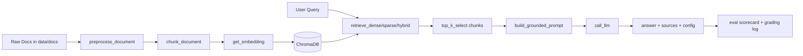

# GROUP REPORT TEMPLATE (SCORING-OPTIMIZED) — LAB DAY 08

Muc tieu cua template nay la bao phu day du rubric trong SCORING, khong bo sot hang muc nao, va moi claim deu co bang chung doi chieu duoc.

---

## 0) Cover Page

- Ten nhom: [..]
- Thanh vien: [..]
- Tech Lead: [..]
- Cau hinh dung cho grading official: [dense/hybrid/rerank/query-transform]
- Thoi gian chay grading questions: [YYYY-MM-DD HH:mm -> HH:mm]
- Commit hash tong ket truoc 18:00: [..]

---

## 1) Executive Summary (150-220 tu)

Tom tat trong 1 doan duy nhat:
1. Bai toan va pham vi tai lieu (5 docs).
2. Kien truc pipeline da hoan thanh (Indexing -> Retrieval -> Generation -> Eval).
3. Variant da chon va ly do (chi thay 1 bien).
4. Ket qua chinh: raw grading, quy doi /30, diem doc /10, sprint /20.
5. Rui ro con lai va huong cai tien tiep theo.

Mau cau ket:
"Nhom dat [x]/98 raw, quy doi [y]/30 cho phan grading; variant [..] cai thien [metric] tu [a] len [b], voi bang chung tai [file/log]."

---

## 2) Rubric Coverage Matrix (bat buoc)

### 2.1 Tu cham diem nhom 60/60

| Nhom tieu chi | Diem toi da | Diem tu cham | Bang chung cu the |
|---|---:|---:|---|
| Sprint Deliverables | 20 | [..] | [lenh chay + output] |
| Group Documentation | 10 | [..] | [architecture + tuning-log] |
| Grading Questions | 30 | [..] | [logs/grading_run.json] |
| Tong nhom | 60 | [..] | [cong thuc quy doi] |

### 2.2 Risk/Penalty tracker

| Rui ro | Trang thai | Bang chung an toan |
|---|---|---|
| Hallucination trong grading | [Co/Khong] | [cac cau abstain/citation] |
| Thieu file bat buoc | [Co/Khong] | [checklist artifact] |
| Commit qua 18:00 cho code/log/docs | [Co/Khong] | [git log timestamp] |

### 2.3 Bonus tracker (+5)

| Bonus | Trang thai | Bang chung |
|---|---|---|
| LLM-as-Judge trong eval.py (+2) | [Dat/Chua] | [function/commit/output] |
| Log grading du 10 cau + timestamp hop le (+1) | [Dat/Chua] | [logs/grading_run.json] |
| gq06 full marks (+2) | [Dat/Chua] | [bang cham gq06] |

---

## 3) Architecture and Technical Decisions (khop docs/architecture.md)

### 3.1 So do pipeline



### 3.2 Chunking decision

| Muc | Gia tri chot | Ly do | Evidence |
|---|---|---|---|
| Strategy | [section/paragraph aware] | [..] | [output list_chunks] |
| Chunk size | [.. tokens] | [..] | [config trong index.py] |
| Overlap | [.. tokens] | [..] | [config trong index.py] |
| Metadata | source, section, effective_date (+ optional) | bat buoc theo rubric | [inspect_metadata_coverage] |

### 3.3 Retrieval decision

| Muc | Baseline | Variant | Chi thay 1 bien? | Ly do |
|---|---|---|---|---|
| retrieval_mode | [dense] | [..] | [Co/Khong] | [..] |
| top_k_search | [10] | [10/..] | [Co/Khong] | [..] |
| top_k_select | [3] | [3/..] | [Co/Khong] | [..] |
| use_rerank | [False] | [True/False] | [Co/Khong] | [..] |

Neu thay nhieu hon 1 bien, phai giai trinh ro de tranh mat diem A/B explanation.

---

## 4) Sprint-by-Sprint Evidence (20 diem)

### 4.1 Sprint 1 (5 diem)

Checklist minh chung:
- [ ] `python index.py` chay khong loi
- [ ] Tao duoc ChromaDB index
- [ ] Moi chunk co >= 3 metadata bat buoc

Bang ghi:
| Tieu chi | Dat? | Bang chung (copy/paste output ngan) |
|---|---|---|
| index.py run OK (3d) | [Y/N] | [..] |
| metadata du source/section/effective_date (2d) | [Y/N] | [..] |

### 4.2 Sprint 2 (5 diem)

Checklist minh chung:
- [ ] `rag_answer("SLA ticket P1?")` co citation [1]
- [ ] Cau ngoai docs abstain, khong bịa

Bang ghi:
| Tieu chi | Dat? | Bang chung |
|---|---|---|
| Answer co citation [1] (3d) | [Y/N] | [answer snippet + sources] |
| Out-of-doc abstain (2d) | [Y/N] | [answer snippet] |

### 4.3 Sprint 3 (5 diem)

Checklist minh chung:
- [ ] Implement duoc it nhat 1 variant
- [ ] Co ket qua scorecard baseline va variant

Bang ghi:
| Tieu chi | Dat? | Bang chung |
|---|---|---|
| Variant implemented (3d) | [Y/N] | [ham + output compare] |
| 2 scorecard co so lieu thuc (2d) | [Y/N] | [results/scorecard_*.md] |

### 4.4 Sprint 4 (5 diem)

Checklist minh chung:
- [ ] `python eval.py` chay E2E khong crash
- [ ] Co A/B delta ro + giai thich duoc nguyen nhan

Bang ghi:
| Tieu chi | Dat? | Bang chung |
|---|---|---|
| eval.py E2E 10 questions (3d) | [Y/N] | [output run_scorecard] |
| A/B delta + explanation (2d) | [Y/N] | [bang so sanh + doan giai thich] |

---

## 5) Group Documentation Coverage (10 diem)

### 5.1 architecture.md (5 diem)

| Rubric con | Dat? | Bang chung |
|---|---|---|
| Chunk size/overlap/strategy + ly do (2d) | [Y/N] | [section nao trong docs] |
| Retrieval baseline vs variant config (2d) | [Y/N] | [bang config] |
| Co so do pipeline (1d) | [Y/N] | [mermaid/ascii] |

### 5.2 tuning-log.md (5 diem)

| Rubric con | Dat? | Bang chung |
|---|---|---|
| Chi ro 1 bien thay doi + ly do (2d) | [Y/N] | [muc Variant] |
| So sanh >= 2 metrics (2d) | [Y/N] | [bang metric] |
| Ket luan dua tren evidence (1d) | [Y/N] | [doan ket luan] |

---

## 6) Grading Questions Report (30 diem)

### 6.1 Cong thuc tinh diem

Raw total = [..]/98  
Grading score = ([..] / 98) x 30 = [..]/30

### 6.2 Bang 10 cau (chi dung du lieu tu logs/grading_run.json)

| ID | Raw max | Ket qua nhom | Muc cham | Raw dat | Ghi chu ky thuat |
|---|---:|---|---|---:|---|
| gq01 | 10 | [..] | [Full/Partial/Zero/Penalty] | [..] | [..] |
| gq02 | 10 | [..] | [..] | [..] | [..] |
| gq03 | 10 | [..] | [..] | [..] | [..] |
| gq04 | 8 | [..] | [..] | [..] | [..] |
| gq05 | 10 | [..] | [..] | [..] | [..] |
| gq06 | 12 | [..] | [..] | [..] | [..] |
| gq07 | 10 | [..] | [..] | [..] | abstain/anti-hallucination |
| gq08 | 10 | [..] | [..] | [..] | [..] |
| gq09 | 8 | [..] | [..] | [..] | [..] |
| gq10 | 10 | [..] | [..] | [..] | [..] |
| Tong | 98 |  |  | [..] |  |

### 6.3 Deep-dive 2 cau bat buoc

#### Case A: gq06 (cross-doc multi-hop)
- Trieu chung:
- Root cause (indexing/retrieval/generation):
- Cac chunks duoc dung:
- Cach fix/khong fix kip:
- Bai hoc:

#### Case B: gq07 (abstain)
- Cau tra loi chinh xac mong doi: "khong co du lieu trong tai lieu"
- Dau hieu an toan: co noi ro "khong du du lieu" + khong bịa so
- Neu bi tru diem: giai thich nguyen nhan va patch phong ngua lan sau

---

## 7) A/B Comparison (bat buoc cho Sprint 4)

### 7.1 Metric table

| Metric | Baseline | Variant | Delta | Ket luan ngan |
|---|---:|---:|---:|---|
| Faithfulness | [..] | [..] | [..] | [..] |
| Answer Relevance | [..] | [..] | [..] | [..] |
| Context Recall | [..] | [..] | [..] | [..] |
| Completeness | [..] | [..] | [..] | [..] |

### 7.2 Why this variant wins/loses

1. Baseline fail mode ro nhat la gi?
2. Bien thay doi tac dong vao khau nao?
3. Cau nao duoc cai thien ro nhat (ID + diem truoc/sau)?
4. Trade-off: do tre, chi phi token, do on dinh output.

Mau cau scoring-friendly:
"Chung toi giu nguyen chunking, prompt, top_k_select; chi doi retrieval_mode tu dense sang hybrid. Delta Context Recall = +[x], giup [IDs] tu Partial len Full."

---

## 8) Deadline and Artifact Compliance (critical)

| Artifact bat buoc | Co file? | Commit truoc 18:00? | Nguoi phu trach | Bang chung |
|---|---|---|---|---|
| index.py | [Y/N] | [Y/N] | [..] | [git log] |
| rag_answer.py | [Y/N] | [Y/N] | [..] | [git log] |
| eval.py | [Y/N] | [Y/N] | [..] | [git log] |
| logs/grading_run.json | [Y/N] | [Y/N] | [..] | [timestamp 17:00-18:00] |
| results/scorecard_baseline.md | [Y/N] | [Y/N] | [..] | [..] |
| results/scorecard_variant.md | [Y/N] | [Y/N] | [..] | [..] |
| docs/architecture.md | [Y/N] | [Y/N] | [..] | [..] |
| docs/tuning-log.md | [Y/N] | [Y/N] | [..] | [..] |
| reports/group_report.md | [Y/N] | duoc sau 18:00 | [..] | [..] |

---

## 9) Contribution Evidence (ho tro khong mat diem ca nhan)

Muc nay de dong bo voi bao cao ca nhan, tranh claim khong khop code/commit.

| Thanh vien | Vai tro | Cong viec cu the | File/ham lien quan | Commit hash | Giai thich duoc quyet dinh ky thuat? |
|---|---|---|---|---|---|
| [..] | [Tech Lead] | [..] | [..] | [..] | [Y/N] |
| [..] | [Eval Owner] | [..] | [..] | [..] | [Y/N] |
| [..] | [LLM] | [..] | [..] | [..] | [Y/N] |
| [..] | [Retrieval] | [..] | [..] | [..] | [Y/N] |
| [..] | [QA/Docs] | [..] | [..] | [..] | [Y/N] |

---

## 10) Risk Register and Mitigation

| Risk | Muc do | Anh huong diem | Giam thieu da lam | Ke hoach tiep theo |
|---|---|---|---|---|
| Hybrid/rerank chua on dinh | [Low/Med/High] | Sprint3, Sprint4 | [..] | [..] |
| Eval metric con thu cong | [Low/Med/High] | Bonus + tinh nhat quan | [..] | [..] |
| Hallucination o cau khong co du lieu | [Low/Med/High] | Grading penalty | [..] | [..] |

---

## 11) Final Conclusion (6-10 dong)

- Tong ket muc tieu da dat theo diem so.
- Neu chua dat 60/60, neu ro ly do objective.
- Chot 2 cai tien co evidence de lam tiep (khong noi chung chung).

---

## 12) Appendix — Raw Evidence Dump

### A. Output python index.py

```text
[paste output that proves index created + metadata coverage]
```

### B. Output rag_answer (1 citation case + 1 abstain case)

```text
[paste output]
```

### C. Output python eval.py

```text
[paste output]
```

### D. Scorecards

- Baseline summary: [paste from results/scorecard_baseline.md]
- Variant summary: [paste from results/scorecard_variant.md]
- Delta summary: [paste from compare_ab]

### E. Grading log snippet

```json
[paste 2-3 representative entries from logs/grading_run.json]
```

### F. Git proof snippet

```text
[paste git log --name-only --pretty output for deadline proof]
```

---

## Final pre-submit checklist

- [ ] Report map 1-1 den tat ca rubric 60 diem nhom.
- [ ] Moi diem tu cham deu co bang chung trong Appendix.
- [ ] Co bang gq01-gq10 va cong thuc quy doi /30.
- [ ] Co phan gq07 abstain va anti-hallucination rieng.
- [ ] Co A/B delta + giai thich nguyen nhan theo 1 bien thay doi.
- [ ] Co bang doi chieu artifact + deadline 18:00.
- [ ] Co bang dong bo contribution de ho tro bao cao ca nhan.

