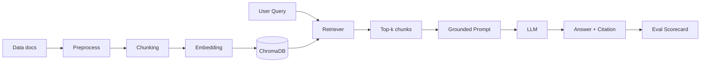

# GROUP REPORT TEMPLATE — LAB DAY 08 (RAG PIPELINE)

> Mục tiêu của template này: giúp nhóm viết báo cáo bám đúng rubric, có bằng chứng rõ ràng, tránh bị trừ điểm do claim mơ hồ hoặc không khớp code/log.

---

## 0) Thông tin nhóm

- **Tên nhóm:** [Điền tên nhóm]
- **Thành viên:** [Tên 1], [Tên 2], [Tên 3], [Tên 4], [Tên 5]
- **Tech Lead:** [Tên]
- **Thời gian chạy grading chính thức:** [YYYY-MM-DD HH:mm]
- **Cấu hình dùng cho grading:** [baseline/variant]

---

## 1) Executive Summary (5-8 dòng)

**Bài toán:** Xây dựng pipeline RAG trả lời câu hỏi nội bộ CS + IT dựa trên tài liệu policy/SLA/SOP/FAQ, có citation và cơ chế abstain.

**Kết quả chính:**
- Pipeline đã chạy end-to-end qua 4 sprint: indexing -> retrieval -> grounded generation -> evaluation.
- Index được build từ 5 tài liệu trong `data/docs` và lưu vào ChromaDB.
- Trả lời có citation theo chunk đã retrieve; câu thiếu dữ liệu dùng cơ chế abstain để giảm hallucination.
- Nhóm triển khai [dense baseline] và [variant: hybrid/rerank/query-transform], chạy so sánh A/B với cùng tập test.
- Điểm raw grading đạt: **[x]/98** -> quy đổi **[y]/30**.

> Lưu ý: chỉ ghi số liệu thật từ log/scorecard, không điền ước lượng.

---

## 2) Kiến trúc pipeline và quyết định kỹ thuật

### 2.1 Sơ đồ pipeline



### 2.2 Chunking decision

- **Chiến lược:** [section-based / paragraph-aware]
- **Chunk size:** [ví dụ 400 tokens]
- **Overlap:** [ví dụ 80 tokens]
- **Lý do chọn:**
	1. [Giữ ngữ cảnh điều khoản, tránh cắt giữa ý]
	2. [Tăng khả năng retrieve đúng bằng metadata theo section]
	3. [Cân bằng giữa recall và độ tập trung context cho LLM]

### 2.3 Metadata policy

Mỗi chunk có tối thiểu 3 trường metadata bắt buộc:
- `source`
- `section`
- `effective_date`

Metadata bổ sung (nếu có):
- `department`
- `access`

**Bằng chứng kiểm tra:**
- [Dán output `list_chunks()` cho 2-3 chunk]
- [Dán output `inspect_metadata_coverage()`]

### 2.4 Retrieval config: baseline vs variant

| Thành phần | Baseline | Variant | Lý do thay đổi |
|---|---|---|---|
| Retrieval mode | [dense] | [hybrid/rerank/query-transform] | [vấn đề baseline cần sửa] |
| top_k_search | [10] | [..] | [..] |
| top_k_select | [3] | [..] | [..] |
| use_rerank | [False] | [True/False] | [..] |

> Rule bắt buộc để điểm cao: nêu rõ nhóm chỉ đổi **một biến chính** trong A/B để giải thích được nguyên nhân cải thiện.

---

## 3) Sprint Deliverables (map trực tiếp với rubric 20 điểm)

### Sprint 1 — Indexing

- Trạng thái: [PASS/FAIL]
- Lệnh chạy: `python index.py`
- Bằng chứng:
	- [Số lượng file đọc được]
	- [Số chunk tạo ra]
	- [Ảnh/chụp terminal output hoặc log ngắn]
- Kết luận sprint 1: [1-2 câu]

### Sprint 2 — Baseline RAG

- Trạng thái: [PASS/FAIL]
- Truy vấn kiểm thử bắt buộc:
	1. `rag_answer("SLA ticket P1?")` -> [có citation [1]/không]
	2. Câu out-of-doc -> [abstain đúng/không]
- Bằng chứng:
	- [1 output câu có citation]
	- [1 output câu abstain]
- Kết luận sprint 2: [1-2 câu]

### Sprint 3 — Variant

- Variant chọn: [hybrid/rerank/query-transform]
- Trạng thái: [PASS/FAIL]
- Lý do chọn biến: [nêu failure mode baseline]
- Bằng chứng:
	- [Output compare strategy hoặc top chunk trước/sau]
	- [Ảnh hưởng đến recall/relevance]
- Kết luận sprint 3: [1-2 câu]

### Sprint 4 — Evaluation

- Trạng thái: [PASS/FAIL]
- Lệnh chạy: `python eval.py`
- Bằng chứng:
	- [Có tạo scorecard baseline]
	- [Có tạo scorecard variant]
	- [Có A/B delta và giải thích]
- Kết luận sprint 4: [1-2 câu]

---

## 4) Grading Questions (30 điểm) — kết quả thật từ log

### 4.1 Thống kê tổng

- Số câu đã chạy: [10/10]
- Raw score: [x/98]
- Quy đổi: `[x/98] * 30 = [y]/30`
- Số câu Full/Partial/Zero/Penalty: [a/b/c/d]

### 4.2 Bảng kết quả 10 câu

| ID | Tóm tắt câu hỏi | Kết quả | Mức chấm | Ghi chú kỹ thuật |
|---|---|---|---|---|
| gq01 | [..] | [Đúng/Sai một phần/Sai] | [Full/Partial/Zero/Penalty] | [retrieval/generation note] |
| gq02 | [..] | [..] | [..] | [..] |
| gq03 | [..] | [..] | [..] | [..] |
| gq04 | [..] | [..] | [..] | [..] |
| gq05 | [..] | [..] | [..] | [..] |
| gq06 | [..] | [..] | [..] | [..] |
| gq07 | [Abstain question] | [..] | [..] | [nêu rõ anti-hallucination] |
| gq08 | [..] | [..] | [..] | [..] |
| gq09 | [..] | [..] | [..] | [..] |
| gq10 | [..] | [..] | [..] | [..] |

### 4.3 Phân tích câu khó nhất (khuyến nghị: gq06 hoặc gq07)

- **Triệu chứng:** [pipeline trả sai/thiếu/chưa đủ điều kiện]
- **Nguyên nhân gốc:** [indexing/retrieval/generation/eval]
- **Bằng chứng:** [source chunks / log]
- **Cách fix đã áp dụng:** [chi tiết ngắn]
- **Kết quả sau fix:** [improve hay chưa]

---

## 5) A/B Comparison (bắt buộc có delta + giải thích)

### 5.1 Bảng metric baseline vs variant

| Metric | Baseline | Variant | Delta | Nhận xét |
|---|---|---|---|---|
| Faithfulness | [..] | [..] | [..] | [..] |
| Answer Relevance | [..] | [..] | [..] | [..] |
| Context Recall | [..] | [..] | [..] | [..] |
| Completeness | [..] | [..] | [..] | [..] |

### 5.2 Tại sao chọn variant này

1. Baseline fail ở đâu: [1-2 lỗi rõ ràng].
2. Variant tác động cơ chế nào: [keyword match / rerank / query rewrite].
3. Bằng chứng: [metric tăng ở câu nào, bao nhiêu].
4. Trade-off: [latency/cost/độ ổn định].

> Câu mẫu mạnh để giảng viên thấy reasoning rõ:
> "Chúng tôi chỉ thay đổi retrieval mode từ dense sang hybrid, giữ nguyên top_k và prompt, nên phần tăng Context Recall +0.xx có thể quy về cơ chế kết hợp semantic + keyword."

---

## 6) Anti-hallucination & gq07 (điểm rủi ro cao nhất)

- Chính sách hệ thống khi thiếu bằng chứng: [abstain message cụ thể]
- Cách ép grounded answer trong prompt: [quote prompt rule]
- Cơ chế kiểm soát trước khi trả lời:
	1. [Kiểm tra số chunk liên quan tối thiểu]
	2. [Nếu không đủ chứng cứ -> abstain]
	3. [Luôn yêu cầu citation]
- Kết quả ở gq07: [abstain rõ lý do / còn mơ hồ / bị hallucinate]
- Hành động phòng ngừa tiếp theo: [1-2 mục]

---

## 7) Bảng đối chiếu file nộp và deadline

| File bắt buộc | Trạng thái | Commit trước 18:00 | Ghi chú |
|---|---|---|---|
| `index.py` | [OK/Thiếu] | [Có/Không] | [..] |
| `rag_answer.py` | [OK/Thiếu] | [Có/Không] | [..] |
| `eval.py` | [OK/Thiếu] | [Có/Không] | [..] |
| `docs/architecture.md` | [OK/Thiếu] | [Có/Không] | [..] |
| `docs/tuning-log.md` | [OK/Thiếu] | [Có/Không] | [..] |
| `logs/grading_run.json` | [OK/Thiếu] | [Có/Không] | [..] |
| `results/scorecard_baseline.md` | [OK/Thiếu] | [Có/Không] | [..] |
| `results/scorecard_variant.md` | [OK/Thiếu] | [Có/Không] | [..] |

> Mẹo an toàn điểm: không claim file nào nếu chưa tồn tại hoặc chưa có số liệu thật.

---

## 8) Phân công đóng góp (để hỗ trợ đối chiếu report cá nhân)

| Thành viên | Vai trò | Công việc cụ thể | Bằng chứng (file/commit/output) |
|---|---|---|---|
| [Tên] | [Tech Lead] | [..] | [..] |
| [Tên] | [Eval Owner] | [..] | [..] |
| [Tên] | [LLM] | [..] | [..] |
| [Tên] | [Retrieval] | [..] | [..] |
| [Tên] | [QA/Docs] | [..] | [..] |

---

## 9) Kết luận nhóm (ngắn, có evidence)

- Điều làm tốt nhất: [1-2 ý có số liệu].
- Điểm còn yếu: [1-2 ý].
- Kế hoạch cải tiến nếu có thêm 1 buổi:
	1. [Cải tiến 1 + expected impact]
	2. [Cải tiến 2 + expected impact]

---

## 10) Phụ lục (copy/paste evidence)

### A. Output tiêu biểu `python index.py`

```text
[Dán output thật]
```

### B. Output tiêu biểu `rag_answer()`

```text
[Dán 1 câu có citation và 1 câu abstain]
```

### C. Output tiêu biểu `python eval.py`

```text
[Dán output thật]
```

### D. Snapshot bảng điểm

- Baseline: [dán bảng]
- Variant: [dán bảng]
- Delta: [dán bảng]

---

## Checklist nộp nhanh trước khi submit

- [ ] Không có claim nào thiếu bằng chứng.
- [ ] Bảng A/B có số thật, có delta, có giải thích nguyên nhân.
- [ ] Có phân tích ít nhất 1 failure mode theo root cause.
- [ ] Nêu rõ chiến lược chống hallucination, đặc biệt cho câu abstain.
- [ ] Đối chiếu đầy đủ file bắt buộc theo rubric.
- [ ] Câu chữ ngắn, rõ, có dữ liệu thay vì mô tả chung chung.

